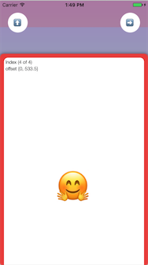
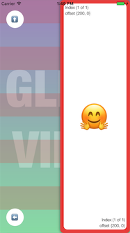
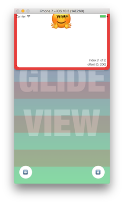
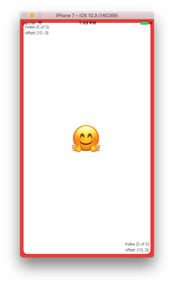

# RDGliderViewController

[](https://travis-ci.org/gelemias/RDGliderViewController) [](https://coveralls.io/github/gelemias/RDGliderViewController?branch=develop) [](https://opensource.org/licenses/MIT)


Control for a draggable ViewController gliding over another ViewController.

RDGliderViewController is a view controller that manages a scrollable view using one side as a sliding point, choosing between Left-to-Right, Top-to-Bottom, Right-to-Left and Bottom-to-Top, and setting an array of offsets as percent values to determine the gliding view steps, as described bellow.

   

## Example

To run the example project, clone the repo, and run `pod install` first.

## Installation

### Using CocoaPods

RDGliderViewController is available through [CocoaPods](http://cocoapods.org). To install
it, simply add the following line to your [Podfile](https://guides.cocoapods.org/using/getting-started.html):

```ruby
pod "RDGliderViewController"
```

### Using Carthage

[Carthage](https://github.com/Carthage/Carthage) is a decentralized dependency manager that builds your dependencies and provides you with binary frameworks.

You can install Carthage with [Homebrew](http://brew.sh/) and then integrate **RDGliderViewController** into your Xcode project adding the following line into your [Cartfile](https://github.com/Carthage/Carthage/blob/master/Documentation/Artifacts.md):

```ruby
github "gelemias/RDGliderViewController"
```

### Manual Installation

For an old fashion installation you can directly add the **header** and **implementation** files for `RDGliderViewController` and `RDScrollView` to your project.

- Download the latest code version or add the repository as a git submodule to your git-tracked project.

- Drag and drop the mention files onto your project and make sure to select **Copy items** if needed.

- Add this `#import "RDGliderViewController.h"` at the beginning of your class.

## Usage

//

## Author

Guillermo RD, gelemias@gmail.com

## License

MIT License

Copyright (c) 2017 Guillermo RD

Permission is hereby granted, free of charge, to any person obtaining a copy
of this software and associated documentation files (the "Software"), to deal
in the Software without restriction, including without limitation the rights
to use, copy, modify, merge, publish, distribute, sublicense, and/or sell
copies of the Software, and to permit persons to whom the Software is
furnished to do so, subject to the following conditions:

The above copyright notice and this permission notice shall be included in all
copies or substantial portions of the Software.

THE SOFTWARE IS PROVIDED "AS IS", WITHOUT WARRANTY OF ANY KIND, EXPRESS OR
IMPLIED, INCLUDING BUT NOT LIMITED TO THE WARRANTIES OF MERCHANTABILITY,
FITNESS FOR A PARTICULAR PURPOSE AND NONINFRINGEMENT. IN NO EVENT SHALL THE
AUTHORS OR COPYRIGHT HOLDERS BE LIABLE FOR ANY CLAIM, DAMAGES OR OTHER
LIABILITY, WHETHER IN AN ACTION OF CONTRACT, TORT OR OTHERWISE, ARISING FROM,
OUT OF OR IN CONNECTION WITH THE SOFTWARE OR THE USE OR OTHER DEALINGS IN THE
SOFTWARE.

## RELEASE NOTES

#### Latest version -  0.1.54
+ 2017-04-20 *[ENV] preparing project for a pod lib*
+ 2017-04-18 *[ENV] Added code coverage support*
+ 2017-04-18 *[ENV] added yml build file for Travis CI*
+ 2017-04-18 *[TEST] Added unit tests for GVScrollView*

#### Previously released:
+ 2017-04-14 *[REF] enhanced  naming*
+ 2017-04-14 *[FIX] issue with rendering shadow when rotating*
+ 2017-04-14 *[FIX] horizontal offset broken*
+ 2017-04-13 *[DEV] first implementation of Left To Right side*
+ 2017-04-13 *[REF] cleaned constraints of scrollview*
+ 2017-04-13 *[DEV] limited max content scroll to largest offset percent of content length*
+ 2017-04-13 *[DEV] added margins to reversed positions*
+ 2017-04-13 *[DEV] first implementation for TopToBottom GlideView*
+ 2017-04-12 *[FIX] fixed release notes not recognised characters*
+ 2017-04-12 *[DOC] added ReleaseNotes to Readme file*
+ 2017-04-07 *[DEV] enhanced threshold calculation for boundaries*
+ 2017-04-07 *[DOC] enhanced documentation on headers*
+ 2017-04-07 *[DEV] improved constructor of GlideViewController*
+ 2017-04-07 *[FIX] offset changes where altered while rotating*
+ 2017-04-06 *[REF] refactored contentSize handling when rotating*
+ 2017-04-06 *[FIX] offset is affected by the margin when rotating a rather large view*
+ 2017-04-06 *[DEV] enable the possibility to change multiple offsets by dragging*
+ 2017-04-06 *[REF] changed offsets approach to % dependant on content’s view*
+ 2017-04-06 *[REF] refactor usage of glideView types*
+ 2017-04-05 *[DEV] enhanced recalculation of offset when rotating scrollview*
+ 2017-04-05 *[FIX] landscape margins offset is off*
+ 2017-04-05 *[FIX] landscape to portrait rotation changes offset of scrollview*
+ 2017-04-05 *[FIX] landscape margins offset is off*
